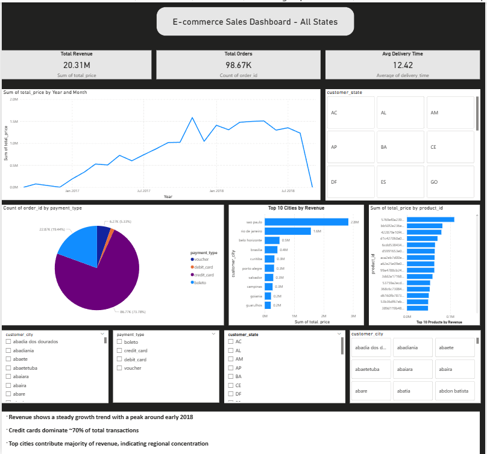

  
  &nbsp;
  
  &nbsp;
  

# 🛒 E-commerce Customer Intelligence & Delivery Optimization

## 📌 Overview

This project simulates a real-world data analytics system inspired by platforms like Amazon, Flipkart, Swiggy, and Zomato.

🚀 **Built an end-to-end data analytics solution using Power BI, SQL, and Python to analyze customer behavior, revenue trends, and delivery performance.**

---

## 🎯 Business Problem
E-commerce platforms often face:

* High customer churn  
* Inefficient delivery operations  
* Poor customer segmentation  

This project addresses these challenges using data analysis and visualization.

---

## 📊 Key Objectives

* Segment customers based on purchase behavior  
* Analyze revenue trends over time  
* Evaluate delivery performance  
* Identify key revenue-driving customers and cities  
* Build an interactive dashboard for decision-making  

---

## 🛠️ Tech Stack

* Python (Pandas, NumPy, Scikit-learn)  
* SQL (MySQL)  
* Power BI  
* Streamlit  

---

## 📂 Project Structure

* Ecommerce-Analytics-Project/
 │
 ├── data/ # Raw & processed data
 ├── notebooks/ # Python analysis notebooks
 ├── dashboard/ # Power BI files
 ├── app/ # Streamlit app (future)
 └── README.md

---

## 📓 Notebooks

- [Data Loading & Analysis](notebooks/Data_Loading.ipynb)

This notebook includes:
- Data cleaning
- Exploratory Data Analysis (EDA)
- Feature engineering
- Business insights

---

## ▶️ How to Use

1. Download the Power BI file from `dashboard/`
2. Open in Power BI Desktop
3. Interact with filters (state, city, payment type)

For Python:
- Open `notebooks/Data_Loading.ipynb` in Jupyter or Colab

---

## 📊 Dashboard Preview  

📁 **Power BI File:** [Download Dashboard](dashboard/Dashboard.pbix)

---

## 🔍 Key Insights

* 📈 Top 20% customers contribute ~70% of total revenue  
* ⏱ Delivery delays are linked with lower customer retention  
* 💳 Credit card payments dominate (~70% of transactions)  
* 🌍 Revenue is concentrated in top cities (regional dependency)  

---

## 💡 Business Impact

* Enabled identification of high-value customers for targeted marketing  
* Highlighted delivery inefficiencies affecting retention  
* Provided a centralized dashboard for data-driven decision-making  

---

## 🚀 Future Improvements

* Real-time data pipeline integration  
* Advanced recommendation system  
* A/B testing for customer retention strategies  

---

## 📎 Author  
**Harsh Vardhan Singh**
